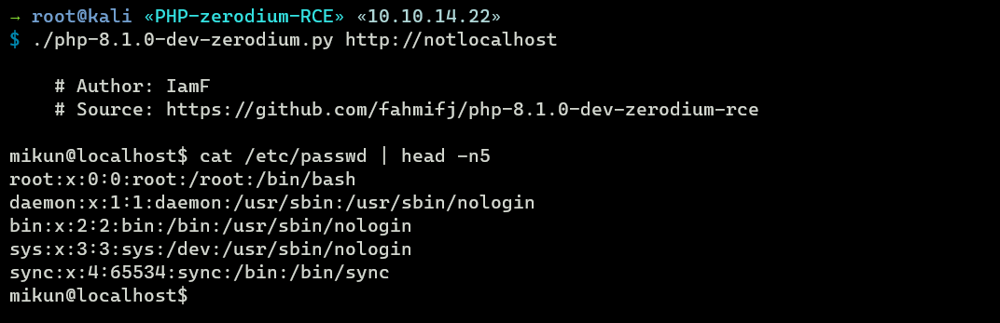

# Unauthenticated RCE via User-Agent in PHP 8.1.0-dev  

Exploit background: https://news-web.php.net/php.internals/113838

## Usage

Linux
```
chmod +x php-8.1.0-dev-zerodiumRCE
./php-8.1.0-dev-zerodiumRCE [url]
```

Windows
```
python php-8.1.0-dev-zerodiumRCE [url]
```

If the target is vulnerable, the exploit will give you a prompt.



## References
- https://twitter.com/scurippio/status/1377029387334393861/retweets
- https://fengchenzxc.github.io/%E6%BC%8F%E6%B4%9E%E5%A4%8D%E7%8E%B0/%E5%BC%80%E5%8F%91%E8%AF%AD%E8%A8%80%E6%BC%8F%E6%B4%9E/PHP/PHP%20zerodium%E5%90%8E%E9%97%A8%E6%BC%8F%E6%B4%9E/
- https://youtube.com/watch?v=iwR746pfTEc&t=2460 (cmdloop)